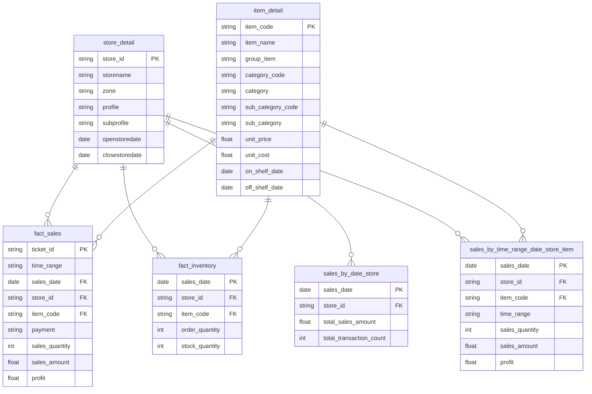

<div align="center">
  <h1>📊 ZJ LESS Retail BI & BigQuery Data Warehouse</h1>
  <h3>Enterprise Data Engineering & Assortment Opportunity Gap Analytics</h3>

  <p>
    <a href="https://cloud.google.com/bigquery"></a>
    <a href="https://lookerstudio.google.com/"></a>
    <a href="sql/"></a>
    <a href="docs/"></a>
  </p>

  <p>
    <b>A full-stack Business Intelligence & Data Warehousing portfolio project analyzing 12 retail branches.</b><br>
    Features an optimized <b>Star Schema data model</b>, pre-aggregated performance layers, and an automated <b>"Missing Item Alert 🔥"</b> engine designed to capture zero-touch revenue opportunities.
  </p>

  <p>
    <a href="web-portfolio/index.html">🌐 <b>Launch Interactive Retro CRT Portfolio Web</b></a> • 
    <a href="https://datastudio.google.com/reporting/22b70fff-c855-44b9-9f39-fdda4812c149" target="_blank">📈 <b>View Real Looker Studio Dashboard</b></a> • 
    <a href="docs/kpi_dictionary_and_logic.md">📗 <b>KPI Dictionary</b></a> • 
    <a href="docs/dashboard_data_prep_and_blending.md">📊 <b>Data Prep & Blending</b></a> • 
    <a href="sql/">💻 <b>SQL Pipeline</b></a>
  </p>
</div>

---

## 📌 Executive Overview / บทสรุปผู้บริหาร

This repository contains the end-to-end data engineering architecture, SQL formulation logic, and Looker Studio reporting layer for **ZJ LESS**, a multi-branch retail network operating across diverse geographical zones (East, South, West, BKK, Isan) and customer profiles (Tourist, Office, Residential).

### 🌟 Core Analytical Capabilities
1. **Executive Matrix Analysis:** Cross-dimensional evaluation between geographical zones and store operating profiles, identifying high-performing customer segments (e.g., Tourist zones achieving peak BPSD efficiency).
2. **Hierarchy Drill-Down:** Multi-tier product categorization tracking sales velocity from top-level `Group Items` down to SKU-level `Top 10 Best Sellers`.
3. **YoY Growth Engine:** Comparative historical tracking to isolate growth drivers against market deceleration.
4. **Assortment Opportunity Gap (Missing Item Alert 🔥):** An algorithmic zero-touch detection engine that identifies top-selling regional items absent in specific branch assortments and projects immediate monthly revenue uplift upon restocking.

---

## 🏛️ BigQuery Star Schema & Aggregated Data Architecture

The data warehouse is built on Google BigQuery using an optimized **Star Schema** with an aggregation layer. POS transaction-level data is stored in the master fact table `fact_sales`, which is then pre-aggregated into daily summary tables (`sales_by_date_store` and `sales_by_time_range_date_store_item`) to guarantee extremely fast Looker Studio dashboard load times and minimize GCP query scan costs.



> [!TIP]
> **⚡ BigQuery Performance & Cost Optimization Best Practice:**
> When creating tables in Google BigQuery to connect to Looker Studio, if there is a `DATE` field, **table partitioning is highly recommended across all tables** (e.g., `PARTITION BY sales_date`).
> Without partitioning, every time Looker Studio refreshes the report or queries data, it will perform a **Full Table Scan** on BigQuery, even if date range filters are applied on the dashboard. Partitioning restricts the query scope to matching partitions (Partition Pruning), significantly reducing data scan costs and boosting dashboard performance.

---

## 💡 SQL Showcase: The Zero-Touch Assortment Gap Algorithm

The centerpiece of our data pipeline is the automated **Missing Item Alert Engine** ([`sql/02_assortment_opportunity_gap.sql`](sql/02_assortment_opportunity_gap.sql)). It checks a target month and flags items as `"missing"` if they are Top 10 Category Best-Sellers network-wide but meet the strict **Zero-Touch Condition** at a specific store:

$$\text{Zero-Touch Condition} = (\text{Sales} = 0) \land (\text{Stock} = 0) \land (\text{Orders in Transit} = 0)$$

```sql
-- Production SQL Query for Missing Item Gap Analysis
CREATE OR REPLACE TABLE `bi-project-test-101.Data_Mock_ZJ.missing_item_monthly` AS

WITH vars as (
  SELECT DATE "2025-01-01" AS from_date, DATE "2025-01-31" AS to_date
),

std as (
  -- Calculate total network-wide operating days across all active stores (storeday)
  SELECT COUNT(DISTINCT store_id || sales_date) as storeday 
  FROM `bi-project-test-101.Data_Mock_ZJ.sales_by_date_store` 
  CROSS JOIN vars
  WHERE sales_date BETWEEN from_date AND to_date
),

sales_by_item as (
  -- Calculate BPSD and UPSD per item using the aggregated fact table
  SELECT 
        fact.item_code,
        category,
        SAFE_DIVIDE(SUM(sales_amount), AVG(storeday)) as BPSD,
        SAFE_DIVIDE(SUM(sales_quantity), AVG(storeday)) as UPSD
  FROM `bi-project-test-101.Data_Mock_ZJ.sales_by_time_range_date_store_item` as fact
  CROSS JOIN vars
  CROSS JOIN std
  LEFT JOIN `bi-project-test-101.Data_Mock_ZJ.item_detail` as item_detail
        ON fact.item_code = item_detail.item_code
  WHERE sales_date BETWEEN from_date AND to_date 
  GROUP BY 1,2
),

ranked_sales as (
  -- Rank best-sellers per category
  SELECT 
        RANK() OVER(PARTITION BY category ORDER BY BPSD, UPSD DESC) as rank,
        item_code, category, BPSD, UPSD
  FROM sales_by_item
),

active_store as (
  SELECT DISTINCT store_id
  FROM `bi-project-test-101.Data_Mock_ZJ.sales_by_date_store`
  CROSS JOIN vars
  WHERE sales_date BETWEEN from_date AND to_date
),

missing_item_top10 as (
  SELECT rank, item_code, category, BPSD
  FROM ranked_sales
  WHERE rank <= 10
),

sales_by_store_item_missing as (
  SELECT fact.store_id, fact.item_code, SUM(sales_amount) as sales_amount
  FROM `bi-project-test-101.Data_Mock_ZJ.sales_by_time_range_date_store_item` as fact
  CROSS JOIN vars
  JOIN active_store ON fact.store_id = active_store.store_id
  JOIN missing_item_top10 ON fact.item_code = missing_item_top10.item_code
  WHERE sales_date BETWEEN from_date AND to_date
  GROUP BY 1,2
),

order_stock as (
  -- Check inventory stock level and orders in transit
  SELECT 
        fact.store_id, fact.item_code,
        SUM(order_quantity) as order_quantity,
        MAX(stock_quantity) as stock_quantity
  FROM `bi-project-test-101.Data_Mock_ZJ.fact_inventory` fact
  CROSS JOIN vars
  WHERE sales_date BETWEEN from_date AND to_date
  GROUP BY 1,2
)

SELECT
      from_date, to_date, active_store.store_id, category, rank, missing_item_top10.item_code,
      BPSD, sales_amount, order_quantity, stock_quantity,
      CASE WHEN sales_amount > 0 OR order_quantity > 0 OR stock_quantity > 0 THEN null ELSE "missing" END as missing_item
FROM active_store
CROSS JOIN missing_item_top10
CROSS JOIN vars
LEFT JOIN sales_by_store_item_missing ON active_store.store_id = sales_by_store_item_missing.store_id AND missing_item_top10.item_code = sales_by_store_item_missing.item_code
LEFT JOIN order_stock ON active_store.store_id = order_stock.store_id AND missing_item_top10.item_code = order_stock.item_code
ORDER BY 1,2,3;
```

---

## 📐 Standardized Retail Metrics & Formulation

To evaluate branches fairly regardless of temporary closures or renovation days, all core metrics utilize **actual store operating days** as denominators.

| Metric | Full Name | Standard Formula |
| :---: | :--- | :--- |
| **BPSD** | Baht Per Store Per Day | `Total Sales Revenue / Total Store Operating Days` |
| **GPPSD** | Gross Profit Per Store Per Day | `Total Gross Profit / Total Store Operating Days` |
| **TA** | Ticket Average (Basket Size) | `Total Sales Revenue / Total POS Transactions` |
| **UT** | Units Per Transaction | `Total Physical Units Sold / Total POS Transactions` |
| **%GP** | Gross Profit Margin % | `(Total Gross Profit / Total Sales Revenue) × 100` |

> [!WARNING]
> **⚠️ BI Constraint Warning (ข้อควรระวังในการใช้งาน):**
> Metrics related to transaction counts (**TCPSD, TA, UT**) can only be filtered by **Store-level dimensions** (e.g., Zone, Profile, Branch ID).
> Since analyzing ticket volumes at the store level is already sufficient for operational needs, querying transaction patterns at the item level is locked. To make ticket counts filterable by items, Looker Studio would need to perform `COUNT(DISTINCT ticket_id)` queries over millions of raw POS receipt rows. This incurs massive BigQuery data scan costs, causes severe dashboard lag, and is not cost-effective (Cost-Performance Trade-off).

*For full formulation guidelines, see our [**Retail KPI Dictionary & Logic Guide**](docs/kpi_dictionary_and_logic.md).*


---

